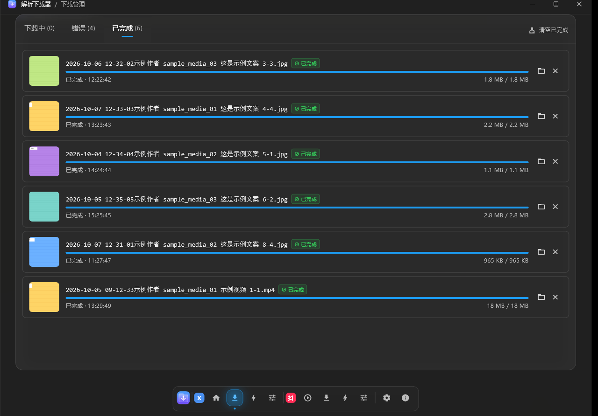
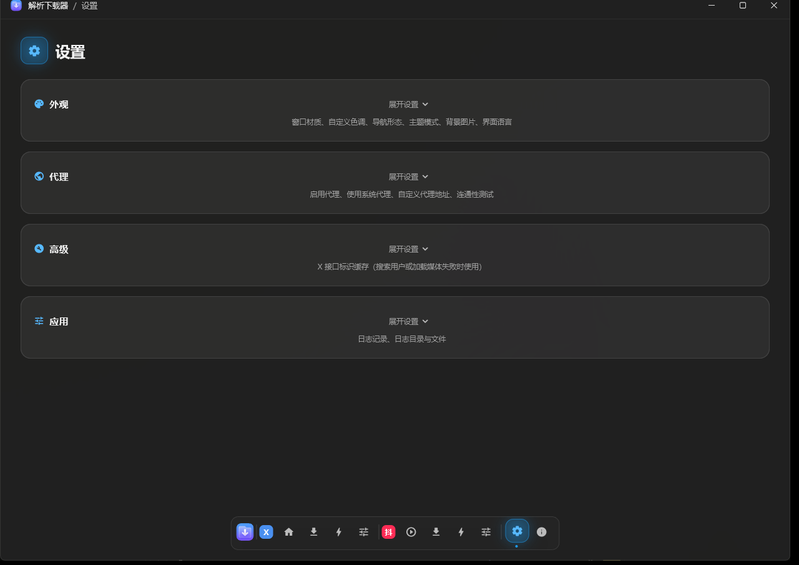

<div align="center">


# 解析下载器

批量下载 X 与抖音上的图片、视频。


</div>

## ⚠️ 使用前说明

- 只支持 **Windows 10 64 位及以上**；抖音模块需要 **WebView2 Runtime**（Win11 自带，Win10 可能要单独装）。
- 需要你在应用内登录一次。凭据**只写在本机**，程序不发往任何第三方服务器。
- 抖音模块读取页面自己已经取回的响应，**不生成、不计算平台签名参数**。
- 请自行遵守 X 与抖音的服务条款，下载内容建议仅作个人备份。

## ✨ 功能

| 模块 | 能做什么 |
|---|---|
| **X** | 按用户名 / ID 翻页抓取，日期与媒体类型过滤，批量下载图片、视频、GIF |
| **抖音** | 内嵌浏览器按页面实际渲染出来的作品识别，多下载源与质量优先策略，图集与实况照片 |
| **下载管理** | X 与抖音各一个入口、各看各的队列；暂停 / 继续 / 单条重试 / 一键重试失败项；失败自动换源并退避重试 |
| **落盘命名** | 目录与文件名模板可自定义；同文件跳过（点重试也不会落出一堆重复副本） |
| **外观** | 主题、窗口材质、背景图、导航形态（侧栏 / dock）、界面语言 |

## 📸 界面

| 下载管理 | 设置 |
|---|---|
|  |  |

## ⬇️ 下载

去 **[Releases](releases)** 下载安装包（约 16 MB，附件名是 `parse-downloader_<版本>_x64-setup.exe`）。

数据（设置、日志、下载台账、X 登录 cookie、抖音登录态）都在 **exe 同级的 `userdata\`** ——
装在哪就在哪，卸载前想留就整个目录拷走。不含遥测，不自动更新。

## 🛠️ 自己构建

```powershell
flutter pub get
flutter analyze && flutter test
flutter build windows --release --no-tree-shake-icons   # 这个参数不能省，否则图标会被裁光
python installer/build_installer.py                     # 产出 build\dist\...-setup.exe
python tool/verify_release.py                           # 发布门：版本一致 / 产物不旧 / 没打进运行时数据
```

前提：项目路径纯 ASCII、开启 Windows 开发者模式、装好 NSIS。
外部工具位置都能用环境变量覆盖（`FLUTTER_BAT` / `NSIS_DIR` / `INSTALLER_OUT_DIR`），
仓库放在哪都能跑。行尾由 `.gitattributes` 钉死，别依赖全局 `core.autocrlf`。

## 📄 许可证

基于开源项目 [X-Spider](https://github.com/MiningCattiva/x-spider) 二次开发，
整体遵循 **GPL-3.0-or-later**。全文见 [LICENSE](LICENSE)，
第三方组件与出处说明见 [NOTICE](NOTICE)。

GPL-3.0 要求的是随程序附上许可证全文并作出声明，不要求每个源文件都带许可证头。
再分发时请把 `LICENSE`、`NOTICE` 和本节一起带走。
